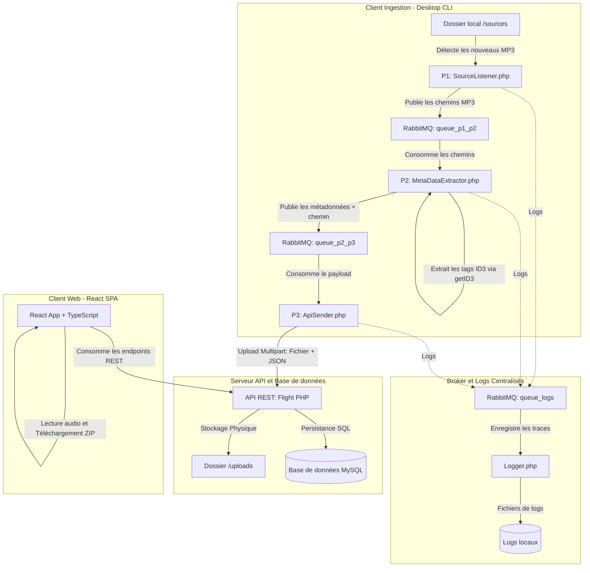

# 🎵 Gestionnaire MP3 Distribué & Générateur de Playlists

[](#)
[](#)
[](#)
[](#)
[](#)
[](#)

Ce projet implémente une architecture logicielle distribuée et découplée pour l'ingestion, le traitement et la diffusion de fichiers MP3. Il se compose d'un client d'ingestion asynchrone (CLI PHP + RabbitMQ) chargé de surveiller, d'extraire les métadonnées et d'envoyer les fichiers audio vers un serveur centralisé (API REST Flight PHP), ainsi que d'une interface web moderne (React + TypeScript + Vite) permettant de gérer sa bibliothèque et de générer intelligemment des playlists sous contraintes (algorithme d'optimisation).

---

## 🛠️ Stack Technique

### Backend & Ingestion (Desktop CLI)
*   **Langage :**  PHP 8.2 (CLI)
*   **Messagerie / Broker :**  RabbitMQ (via `php-amqplib`) pour la communication asynchrone entre services.
*   **Traitement Audio :**  James-Heinrich/getID3 pour analyser et extraire les métadonnées ID3 des MP3.

### API Server
*   **Framework :**  Flight PHP (Micro-framework RESTful)
*   **Base de Données :**  MySQL / MariaDB pour la persistance des métadonnées et des playlists.
*   **Serveur Web :** Serveur PHP intégré (idéal pour le développement).

### Frontend (Application Web)
*   **Librairie UI :**  React 19 (Hooks, Contexts, Architecture modulaire)
*   **Langage :**  TypeScript (Typage fort pour une meilleure robustesse)
*   **Build Tooling :**  Vite (Développement ultra-rapide)

---

## 📐 Architecture & Flux de Données

Le système applique le pattern d'intégration d'applications d'entreprise (EAI) basé sur les files de messages (**Message Broker**) afin de garantir le découplement et la tolérance aux pannes des composants d'ingestion.



---

## ✨ Fonctionnalités Principales

*   **Ingestion Distribuée et Découplée :** Les opérations d'ingestion locale sont découpées en 3 scripts autonomes (`SourceListener`, `MetaDataExtractor` et `ApiSender`) qui communiquent de façon asynchrone via des files d'attente RabbitMQ.
*   **Journalisation Centralisée (Logger Asynchrone) :** Tous les scripts d'ingestion envoient leurs événements de suivi et d'exception dans une file de logs dédiée. Un service Logger autonome consomme cette file pour écrire des fichiers journaux structurés et horodatés.
*   **Extraction de Métadonnées Automatique :** Extraction des tags ID3 (titre, artiste, album, genre, durée, bitrate, taille, etc.) des fichiers MP3 à l'aide de la bibliothèque getID3.
*   **Garantie de Suppression Locale :** Le fichier MP3 d'origine présent dans le dossier d'ingestion (`sources/`) n'est supprimé de l'espace local qu'après la réussite de l'upload et de l'enregistrement sur l'API Web.
*   **API REST Robuste (Flight PHP) :** Endpoints complets de gestion de la bibliothèque audio (CRUD des MP3, listing, création et suppression des playlists).
*   **Générateur Intelligent de Playlists :** Algorithme proposant une playlist dont la durée cumulée se rapproche au plus près de la durée cible spécifiée (valeur absolue minimale de l'écart), en appliquant des critères multiples d'inclusions/exclusions (artistes, genres, langues).
*   **Lecteur Audio Intégré :** Player audio fluide permettant de jouer, mettre en pause, et naviguer dans les morceaux de la playlist en cours.
*   **Export ZIP de Playlists :** Téléchargement instantané des playlists générées sous la forme d'une archive compressée ZIP contenant tous les fichiers audio physiques.

---

## 🚀 Installation & Lancement du Projet

### 1. Prérequis
Assurez-vous que les outils suivants sont installés sur votre machine :
*   **PHP >= 8.2** (avec les extensions requises : `pdo_mysql`, `sockets`, `curl`, `mbstring`, `fileinfo`)
*   **Composer**
*   **Node.js >= 18** et **npm**
*   **RabbitMQ Server** (installé localement ou accessible en ligne)
*   **MySQL Server** ou **MariaDB** (port par défaut `3307`, ajustable dans la configuration)

### 2. Base de Données
Créez la base de données et les tables nécessaires à l'aide du script SQL fourni :
```bash
mysql -u root -p -P 3307 < desktop/api/base.sql
```
*(Remplacez les paramètres de connexion selon votre configuration locale).*

### 3. Backend & Client d'Ingestion (Desktop)
1. Déplacez-vous dans le répertoire du projet desktop :
   ```bash
   cd desktop
   ```
2. Installez les dépendances PHP requises (incluant `php-amqplib` et `getID3`) :
   ```bash
   composer install
   ```
3. Vérifiez la configuration dans `desktop/config/config.php` (hôtes, ports, identifiants RabbitMQ et API).
4. Vérifiez la configuration de la base de données dans `desktop/api/database.php`.
5. Lancez l'ensemble des services d'ingestion et le serveur API :
   *   **Sous Windows :** Exécutez le script d'initialisation rapide :
       ```bash
       start.bat
       ```
   *   **Manuellement (dans des terminaux distincts) :**
       ```bash
       # Lancer le service centralisé de log
       php src/Logger.php

       # Lancer le démon de surveillance de fichiers (P1)
       php src/SourceListener.php

       # Lancer le consommateur d'extraction de métadonnées (P2)
       php src/MetaDataExtractor.php

       # Lancer le consommateur d'envoi API (P3)
       php src/ApiSender.php

       # Démarrer le serveur API local
       php -S localhost:8080 router.php
       ```

### 4. Application Web (Frontend)
1. Déplacez-vous dans le répertoire du projet web :
   ```bash
   cd ../web
   ```
2. Installez les paquets npm :
   ```bash
   npm install
   ```
3. Démarrez le serveur de développement Vite :
   ```bash
   npm run dev
   ```
4. Ouvrez votre navigateur sur l'adresse fournie par Vite (généralement `http://localhost:5173`).

---

## 📸 Screenshots

Voici un aperçu de l'interface utilisateur web permettant la gestion de la bibliothèque audio et la configuration des playlists.

### Interface Principale & Bibliothèque MP3
[SCREENSHOT]

### Générateur Intelligent de Playlist & Lecteur Audio
[SCREENSHOT]

---

## 📄 Licence

Ce projet est distribué sous la licence MIT. Voir le fichier `LICENSE` pour plus d'informations.